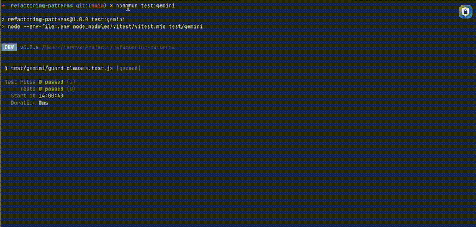

# Refactoring Patterns Guide

A collection of refactoring patterns and coding guidelines designed to work with AI coding assistants (Claude Code, Cursor) for improved code quality and maintainability.

## Quick Setup

Copy the guidelines into your project:

**For Claude Code users:**
```bash
mkdir -p /path/to/your/project/.claude
cp .claude/claude.md /path/to/your/project/.claude/
```

**For Cursor users:**
```bash
mkdir -p /path/to/your/project/.cursorrules
cp .claude/claude.md /path/to/your/project/.cursorrules/
```

Then enable the file in Cursor:
1. Open Cursor Settings (Cmd/Ctrl + ,)
2. Search for "Rules for AI"
3. Enable the `claude.md` file you copied

You can modify these files to add your own project-specific rules, preferred libraries, or coding conventions.

## Supported Patterns

See the [Supported Patterns](docs/supported-patterns.md) document for a complete list of refactoring patterns organized by type (General Principles and Situational Principles).

## Rubric Testing with LLM

This project includes automated tests that use LLMs to evaluate code quality against refactoring guidelines. The tests compare bad examples, good examples, and candidate code to assess whether refactoring principles are properly applied.

**How it works:**
- Each refactoring pattern has before/after examples
- Tests send these examples to an LLM (Gemini) along with candidate code
- The LLM evaluates and scores the code based on the rubric
- Responses include a score (0-1), reasoning, and refactored code

**Running the tests:**
```bash
# Copy the example env file and add your API key
cp .env.example .env

# Add your Gemini API key to .env
# GEMINI_API_KEY=your_key_here

# Run the rubric tests
npm run test:gemini
```



*Visual walkthrough of how the LLM evaluates code against the guidelines*
